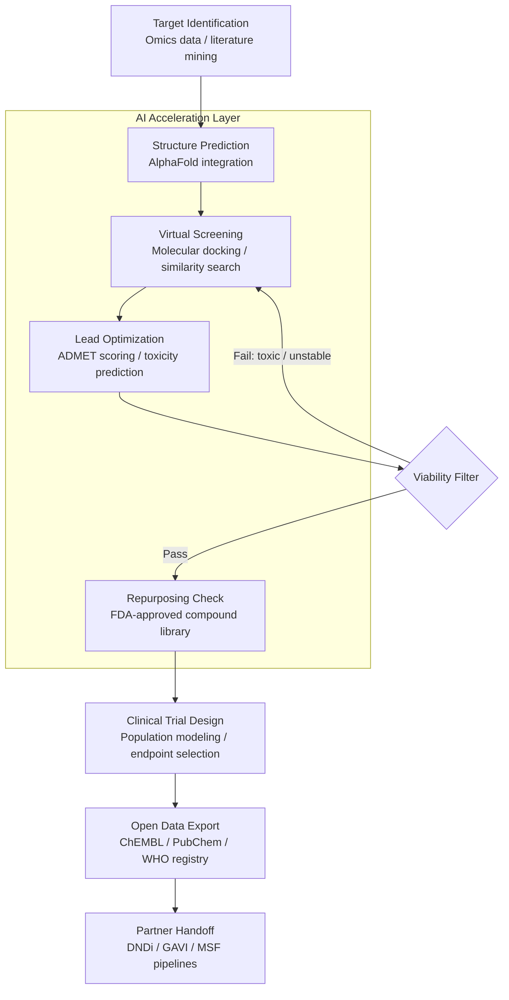

<p align="center">
  <h1 align="center">MAMA Drug Discovery</h1>
  <h3 align="center"><em>AI-accelerated drug discovery for neglected tropical diseases.<br>1.7 billion people. $0 in commercial R&D investment.</em></h3>
</p>

<p align="center">
  <a href="LICENSE"></a>
  
  
  
  
  <a href="https://mama.oliwoods.ai"></a>
  <a href="https://mama.oliwoods.ai/foundation"></a>
</p>

---

> **Neglected Tropical Diseases affect 1.7 billion of the world's poorest people — and received less than 1% of global health R&D investment in 2022.** The market has failed here completely: developing a drug costs $2.6 billion and takes 12 years. For diseases that primarily affect people without purchasing power, that math will never work. **This library brings AI to the front of the pipeline: protein structure prediction, compound screening, literature mining, and clinical trial design — all open-source, all free, specifically targeting the 20 WHO-defined NTDs that commercial pharma ignores.** Every shortcut we find in the pipeline is years faster to treatment for a child with schistosomiasis in sub-Saharan Africa.

---

## Why This Exists

- **The NTD treatment gap is systemic, not scientific.** We have drugs for conditions that affect wealthy people. We don't have drugs for conditions that kill the poor. The science is the same — the economics are different. We're removing the economics barrier.
- **1.7 billion people affected by 20 NTDs** (WHO, 2023): dengue, schistosomiasis, lymphatic filariasis, leishmaniasis, Chagas disease, trachoma, and 14 others. Most have no approved treatment. Several have treatments unchanged since the 1950s.
- **Drug discovery AI is mature but siloed behind billion-dollar labs.** AlphaFold, molecular docking, ADMET prediction — these tools exist. They're behind institutional paywalls, API rate limits, and proprietary pipelines. This library makes them composable and free.
- **Open-source biology is already winning.** The Drugs for Neglected Diseases initiative (DNDi) has delivered 9 treatments since 2003 at 1/10th the cost of traditional pharma R&D by sharing data. We're building the AI layer on top of that open model.

---

## How It Works



---

## Features & Modules

| Module | What It Does |
|--------|-------------|
| **target-identification** | Literature mining across PubMed, ChEMBL, and UniProt. Identifies druggable protein targets for specific NTD pathogens using NLP + graph analysis |
| **structure-prediction** | AlphaFold2 integration for protein structure prediction. Outputs PDB files ready for docking pipelines. Includes confidence scoring |
| **virtual-screening** | Molecular docking with AutoDock Vina integration. Screens compound libraries (1M+ molecules) against predicted structures. Returns ranked hit lists |
| **admet-scoring** | ADMET (Absorption, Distribution, Metabolism, Excretion, Toxicity) prediction using ML models trained on DrugBank and ChEMBL data |
| **compound-repurposing** | Cross-references FDA-approved drug library against NTD targets. Identifies repurposing candidates with existing safety profiles |
| **literature-mining** | PubMed + bioRxiv NLP pipeline. Extracts compound-target relationships, trial results, and mechanism of action data |
| **clinical-trial-design** | Statistical power calculators, endpoint selection tools, and population modeling for NTD-endemic settings (low infrastructure, high dropout) |
| **data-export** | Standardized export to ChEMBL, PubChem, and WHO International Clinical Trials Registry Platform. Open by default |
| **pathway-analysis** | Metabolic pathway disruption modeling for parasite/pathogen targets. Identifies essential pathways with no human ortholog |
| **biomarker-discovery** | Omics data integration for diagnostic biomarker identification. Prioritizes field-deployable biomarkers for resource-limited settings |

---

## How It Works — Technical

This is a **TypeScript algorithm library** with Python interop for computational chemistry workflows. Pure functions with Zod schemas for all data validation.

```typescript
import {
  mineTargetsFromLiterature,    // PubMed NLP → druggable targets
  predictProteinStructure,       // AlphaFold2 integration
  screenCompoundLibrary,         // Virtual docking pipeline
  scoreADMET,                    // Toxicity + pharmacokinetics
  findRepurposingCandidates,     // FDA library cross-reference
  designClinicalTrial,           // Power calc + endpoint selection
} from "mama-drug-discovery";
```

**Pipeline integration:**
```
Literature Mining → Target ID → Structure Prediction → Virtual Screening
→ ADMET Filter → Repurposing Check → Clinical Design → Open Export
```

- All intermediate data exported as open formats (SDF, PDB, CSV)
- Compatible with DNDi, Medicines for Malaria Venture (MMV), and GAVI pipelines
- Python subprocess layer for RDKit and AutoDock Vina computational steps
- No proprietary API dependencies — all data sources are open (PubMed, UniProt, ChEMBL)

---

## Research Backing

> Hotez, P. J., et al. (2007). "Neglected Tropical Diseases of Sub-Saharan Africa: Review of Their Prevalence, Distribution, and Disease Burden." *PLOS Neglected Tropical Diseases, 1*(1). — Establishes the foundational disease burden framework this library is designed to address.

> WHO (2023). *Ending the Neglect to Attain the Sustainable Development Goals: A Road Map for Neglected Tropical Diseases 2021–2030.* — 1.7B people affected. WHO 2030 targets require dramatically accelerated R&D pipelines.

> Jumper, J., Evans, R., Pritzel, A., et al. (2021). "Highly accurate protein structure prediction with AlphaFold." *Nature, 596*, 583–589. — The foundational paper for the structure prediction module. AlphaFold2 models are now available for nearly all known proteins.

> DNDi (2022). *Annual Report.* — Open-source, collaborative drug discovery has delivered 9 new treatments for NTDs since 2003. Average cost per treatment: $100-150M vs. $2.6B industry average.

> Pushpakom, S., et al. (2019). "Drug repurposing: progress, challenges and recommendations." *Nature Reviews Drug Discovery, 18*, 41–58. — Repurposing existing drugs reduces development time by 5-7 years and cuts cost by 60-85%. The repurposing module is based on this framework.

---

## Quick Start

```bash
git clone https://github.com/OliWoods-Org/mama-drug-discovery.git
cd mama-drug-discovery
npm install
pip install -r requirements.txt   # RDKit, AutoDock Vina wrappers
npm run build
npm test
```

## Tech Stack

- **Runtime:** Node.js + TypeScript (algorithm layer) + Python (computational chemistry)
- **Validation:** Zod schemas
- **Cheminformatics:** RDKit (Python), AutoDock Vina (docking)
- **Structure prediction:** AlphaFold2 API / local deployment
- **Data sources:** PubMed API, ChEMBL API, UniProt API, DrugBank (open data)
- **AI:** Claude API for literature NLP / target extraction

---

## Related Projects

| Project | Description |
|---------|-------------|
| [foundation-rare-dx](https://github.com/OliWoods-Org/foundation-rare-dx) | Rare disease diagnosis — separate pipeline, shared target infrastructure |
| [foundation-amr-guard](https://github.com/OliWoods-Org/foundation-amr-guard) | Antimicrobial resistance stewardship — adjacent problem space |
| [mama-ai-clinic](https://github.com/OliWoods-Org/mama-ai-clinic) | Offline clinical AI for settings where NTDs are endemic |
| [foundation-rx-access](https://github.com/OliWoods-Org/foundation-rx-access) | Gets discovered drugs to the patients who need them |

---

## Contributing

We need people across a wide range:

- **Computational chemists** — Validate docking protocols, ADMET models, and scoring functions
- **Bioinformaticians** — Improve target identification pipeline and pathway analysis
- **Clinical researchers** — Review trial design module for NTD-specific endpoints
- **Data engineers** — Expand data source integrations (BindingDB, PDB mirror, etc.)

See [CONTRIBUTING.md](CONTRIBUTING.md) for guidelines.

---

## License

AGPL-3.0. Free forever. An [OliWoods Foundation](https://github.com/OliWoods-Org) project.

> *"Of the 1,393 drugs approved between 1975 and 1999, only 16 were specifically developed for tropical diseases. We have the tools. We just need to aim them."*

---

<p align="center">
  <strong>Built by the <a href="https://oliwoods.ai">OliWoods Foundation</a></strong><br>
  <em>Free forever. Open source. Because 1.7 billion people can't wait for the market to fix this.</em>
</p>
